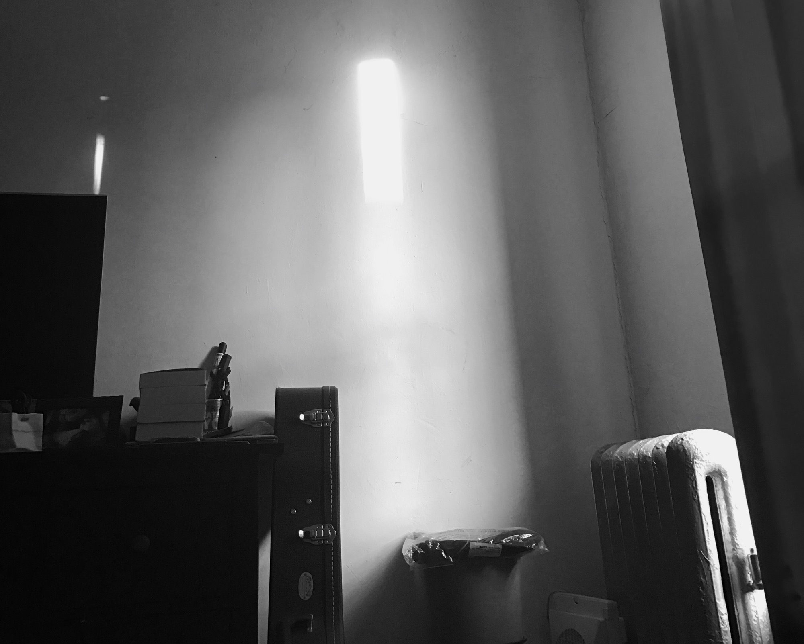

Day 14,917

There's a handy website called [howmanydaysoldami.com](http://howmanydaysoldami.com/). This is why I love the internet. There's a slightly better calculator for this same equation at [jalu.ch](http://jalu.ch/coding/days/en) Jalu is apparently a coder in Switzerland. I don't know Jalu, but his script was easy to find and useful.

Today is the fourteen-thousand, nine-hundred seventeenth day I've been alive. I feel barely alive today. I've had an awful cold since last night and so I've spent most of today, a day which has been marked in history, as a "new era", in bed.

I'm not actively hiding. I'm actually just sick.

See a typo? Send me a [pull-request]()!